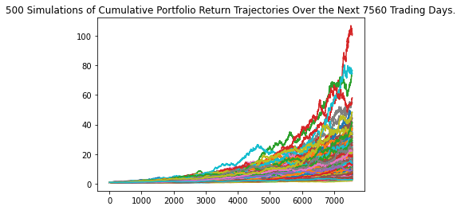
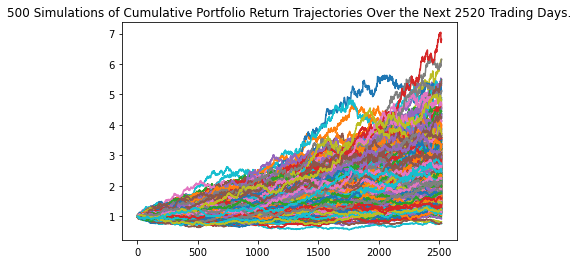
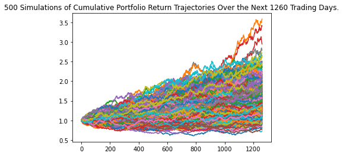
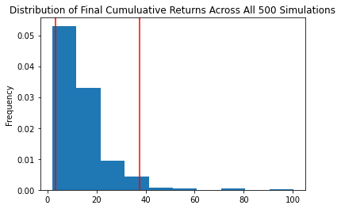
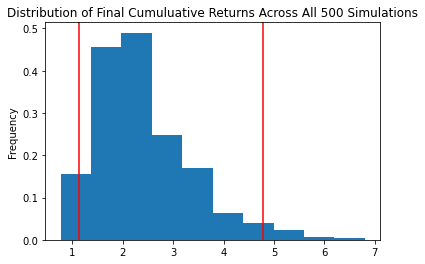

# Financial-Planner
Challenge / Project from Fintech Bootcamp for APIs Week (Week 5)

## Jupyter Notebooks:

* [financial-planner.ipynb](financial-planner.ipynb)
* [financial-planner-withDebuggingComments.ipynb](financial-planner-withDebuggingComments.ipynb)

## Some Plots (Images) from Part 2 - Retirement Planning

| Thirty Years Retirement Option  | Ten Years Retirement Option  |  Five Years Retirement Option |
|---|---|---|
| Monte Carlo Simulation: 30 years |  Monte Carlo Simulation: 10 years |   Monte Carlo Simulation: 5 years|
|    |   |   |
| Monte Carlo Distribution: 30 years  |  Monte Carlo Distribution: 10 years |   Monte Carlo Distribution: 5 years|
|    |   |   |

## Instructions

* [Instructions](Instructions.md)

